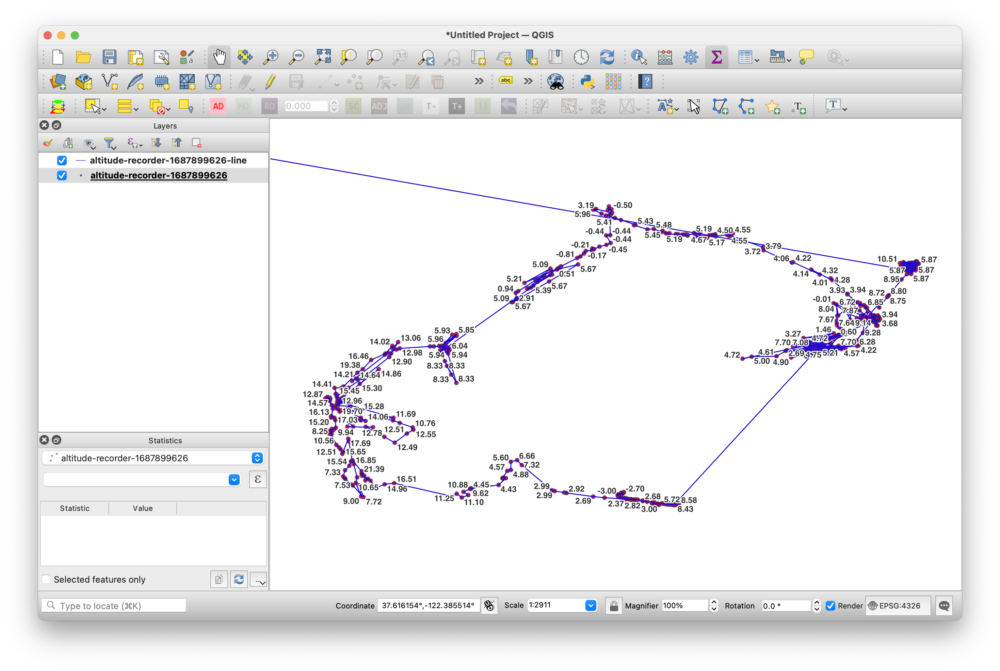

# ios-altitude-recorder

Simple iOS application to collect elevation (altitude) information for one or point in space.

## Motivation

SFO Museum needed a tool to measure, or more precisely to approximate, the different elevations in the SFO terminal complex in advance of more accurate data being produced. This is that tool.

It is a data collection application designed to record location information as it is generated by the operating system's `CoreLocation` framework. Locations can be recorded explicitly in atomic units or continuously as they are received. Data is persisted using the `SwiftData` and can be exported as a GeoJSON `FeatureCollection`.

That's all the application does. It is being released as-is in the spirit of generousity in the hopes that it might be useful to other museums and cultural heritage institutions who need to collect similar data or simply as a reference implementation for how to develop bespoke location-based iOS applications.

## Documentation

Documentation is incomplete at this time.

## Requirements

This application uses [SwiftData](https://developer.apple.com/xcode/swiftdata/) and requires iOS 17 (and XCode 15) or higher to build.

## Interface

The interface provides controls to record atomic locations or to record all (unique) locations as they are reported by the operating system. Locations are persisted using `SwiftData` and can be exported as a GeoJSON `FeatureCollection` using the iOS ShareActivity interface menu.

As locations are received by the application they are added to the map as `MKPointAnnotation` markers.

## Output

All the points collected exported as a GeoJSON file and visualized in QGIS.

Note that the `LineString` feature derived from those points was generated independently of the `ios-altitude-recorder` application.

As you can see indoor location continues to be approximate and imprecise. You should factor that knowledge in to how you use and interpret the data produced by `ios-altitude-recorder`.

Note the way I appear to be floating in mid-air, or standing in the middle of the road, in many spots in this visualization. I guarantee you, I was not.